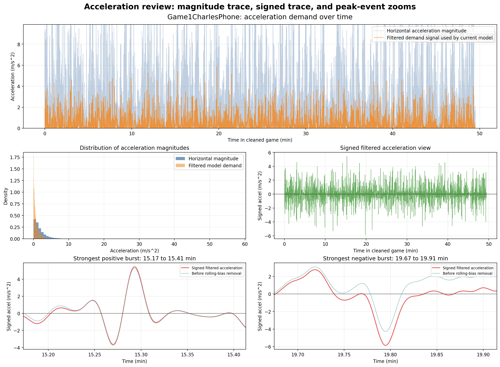
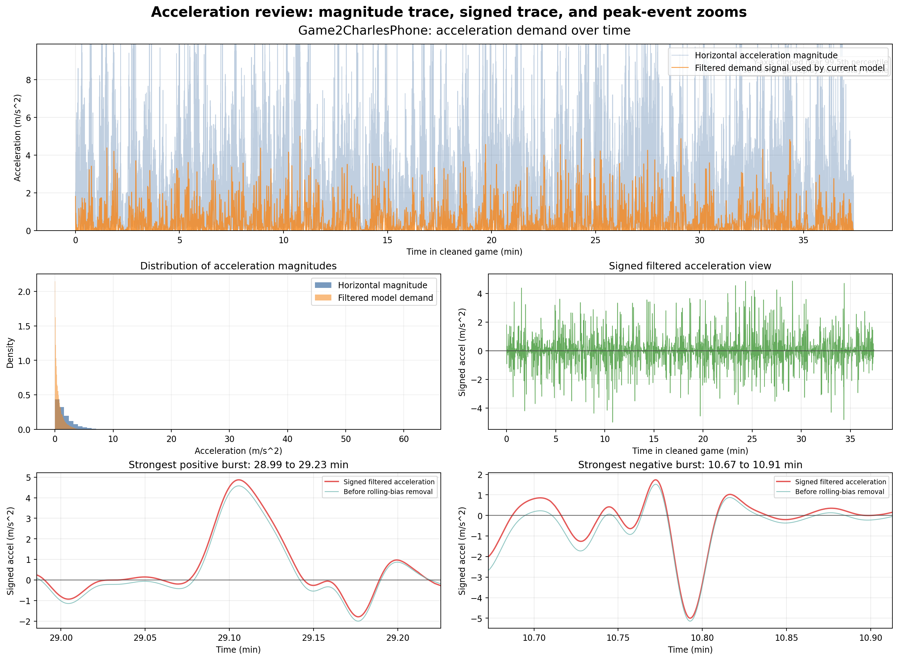
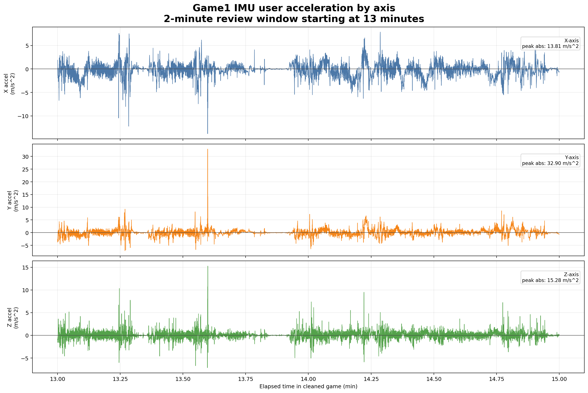
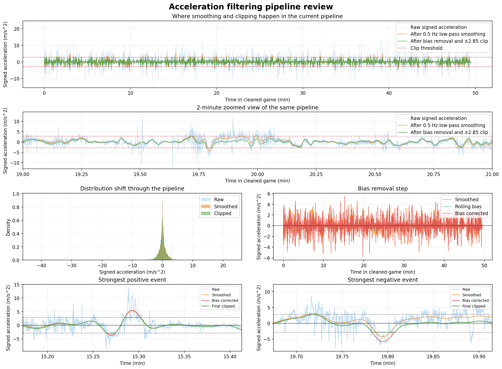
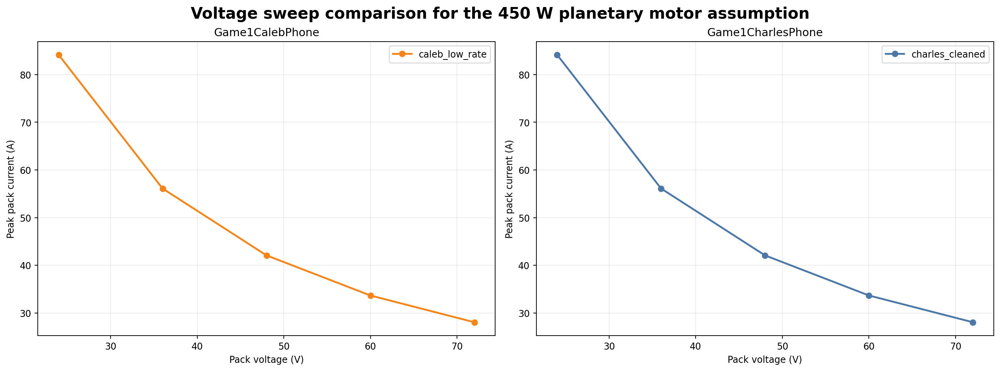
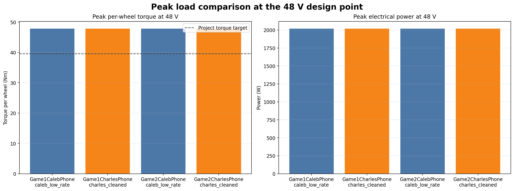

# Powered Sports Wheelchair Motion-to-Battery Experiment Report

## Executive Summary

This project set out to answer a practical senior design question: can real upper-body gameplay motion be translated through a physics-based drivetrain model to estimate whether a lean-controlled powered sports wheelchair is realistic from a battery and motor standpoint?

The answer is yes, but only if the IMU data is interpreted carefully.

The strongest conclusions from the experiment are:

- A motion-history-to-power workflow is viable and much better than guessing battery size first.
- Raw body-mounted IMU spikes can wildly overstate propulsion demand if they are treated as direct wheelchair acceleration.
- A clipped signed-acceleration model with a realism cap of +/-2.85 m/s^2 produced much more believable results.
- Under that clipped model, the selected 450 W planetary motor family with 16:1 gearing is much more plausible than it first appeared.
- Battery voltage does not materially change required power or energy, but it strongly changes pack current.
- A second lower-rate dataset supported the same peak design point after clipping, even though it predicted lower total session energy.

This report documents the full experiment, including the processing workflow, mathematical model, interpretation changes, and the design implications that remain most relevant for the wheelchair concept.

## 1. Project Goal

The design goal was to build a powered sports wheelchair controlled by upper-body lean so the user's hands stay free for sports. The chair should feel athletic and responsive rather than like a generic slow mobility device.

The engineering question behind this report was:

> Given measured IMU motion from real gameplay, what battery, motor, torque, current, and power would be required for a powered chair to reproduce a similar motion profile?

The team intentionally wanted the sizing path to begin from motion and work forward:

```text
acceleration history -> speed history -> force -> wheel torque -> motor torque/current
-> electrical power -> battery energy / capacity
```

## 2. Data Sources

Two independent measurement sets were used.

### Dataset A: Charles phone data

The primary dataset consisted of higher-rate gameplay recordings that were cleaned into separate game windows for analysis. These cleaned Charles recordings became the basis for the original acceleration review, the first battery sizing passes, and the final clipped motor analysis.

### Dataset B: Caleb phone data

A second lower-rate HyperIMU recording captured both games in one file at a 100 ms sample interval, or about 10 Hz. This file required a custom reconstruction step because it included metadata headers rather than a standard CSV header, did not carry an explicit timestamp per sample, and combined both games into one recording.

The lower-rate file was reconstructed, split into separate game windows, and reprocessed using the same clipped-acceleration motor model. That second dataset was not treated as a replacement for the Charles data. Instead, it served as an independent check on whether the main design conclusions depended entirely on sharp high-frequency spikes in one device recording.

## 3. Experimental Workflow

The analysis evolved in stages.

### Stage 1: Clean and inspect the gameplay data

The first step was to isolate the gameplay windows from the raw phone recordings and inspect the acceleration behavior before building any drivetrain model. Those early plots made it clear that the data contained both meaningful motion and suspicious spikes that could not automatically be trusted as propulsion demand.



*Figure 1. Cleaned acceleration review for Charles Game 1. This view helped identify the overall scale of the motion signal before the physics model was applied.*



*Figure 2. Cleaned acceleration review for Charles Game 2. The same review process was repeated across both gameplay windows to compare signal behavior.*



*Figure 3. Exploratory XYZ view from a focused Game 1 time window. This kind of slice was useful for spotting abrupt axis behavior that could reflect body motion or impact rather than pure wheelchair propulsion.*

### Stage 2: Build a first-pass battery sizing model

The first pass mapped cleaned IMU motion directly into traction force, wheel torque, motor torque and current, battery power, and session energy. That branch also included battery chemistry assumptions and a battery-mass feedback loop.

Those early sizing runs were still useful even though some specific intermediate files are no longer packaged with this final report. They established the broad design picture:

- usable energy landed in the rough range of 564 Wh to 774 Wh
- nominal energy landed in the rough range of 626 Wh to 1290 Wh
- battery mass ranged from about 3.9 kg to 36.9 kg depending on chemistry
- peak motor current landed in the rough range of 58 A to 112 A
- peak battery C-rate landed in the rough range of 4.5 C to 7.7 C

That first battery sweep showed an important pattern early: the project looked peak-demand-limited before it looked energy-limited.

### Stage 3: Challenge the raw IMU interpretation

During review, a major issue emerged:

- some high acceleration spikes were likely not propulsion at all
- some large negative spikes likely came from hard stops, collisions, or abrupt contact
- treating raw acceleration magnitude as direct chair demand was too aggressive

This forced a better interpretation:

- signed acceleration should be preserved
- unrealistic peaks should be clipped
- propulsion sizing and crash or contact interpretation should not be treated as the same thing

### Stage 4: Fix the realism problem with clipping

After review, the team chose a peak realistic acceleration limit of 2.85 m/s^2. The revised rule was simple: signed acceleration above +2.85 m/s^2 or below -2.85 m/s^2 was no longer trusted as representative of realistic in-chair propulsion or braking demand for design sizing.



*Figure 4. Filter and clip comparison. This was the turning point in the analysis because it separated plausible propulsion demand from unrealistic spikes.*

### Stage 5: Motor and voltage sweep

The selected concept motor was evaluated with the following assumptions:

- 16:1 planetary gearing
- 11.75 in wheel radius
- 105 kg total system mass
- rolling resistance coefficient Crr = 0.002
- wheel rotational inertia J = 0.2 kg*m^2 per driven wheel
- two-wheel drive

Voltage was then treated as a sweep variable rather than as a fixed assumption. That shift clarified that changing pack voltage mainly changes battery current requirements, not the underlying mechanical power demand.

### Stage 6: Validate against the second dataset

The lower-rate HyperIMU recording was processed with the same clipping rule and compared against the Charles-based analysis. Rather than sending the reader to a separate companion file, the most important comparison figures are reproduced directly in this report below.

## 4. Mathematical Model

This section documents the model used by the analysis scripts.

### 4.1 Signal preprocessing

The phone IMU does not directly give forward wheelchair acceleration. The processing pipeline was:

1. Resample the signal to a uniform timeline.
2. Convert linear acceleration to SI units.
3. Use gravity information to separate vertical and horizontal motion.
4. Construct a signed acceleration demand signal.
5. Low-pass filter the signal.
6. Subtract slow bias.
7. Clip unrealistic peaks.

Conceptually:

```text
a_raw(t) -> a_filtered(t) -> a_clipped(t)
```

For the final clipped runs:

```text
a_clipped(t) = clip(a_filtered(t), -2.85, +2.85)
```

### 4.2 Speed estimate

Speed was estimated by discrete integration with a hard cap:

```text
v[k+1] = clip(v[k] + a[k] * dt, 0, v_max)
```

with:

- v_max = 11 mph

This was not treated as a ground-truth wheel-speed measurement. It was a bounded surrogate speed for power estimation.

### 4.3 Longitudinal force model

The forward traction force was modeled as:

```text
F_trac = m a + F_rr + F_drag + F_grade
```

with:

```text
F_rr = C_rr m g
F_drag = 0.5 rho C_d A v^2
F_grade = 0
```

for the flat-ground cases used here.

### 4.4 Wheel torque with rotational inertia

The wheel torque model included both linear acceleration demand and wheel inertia:

```text
tau_wheel,total = r * F_trac + N_driven * J * (a / r)
```

where:

- r is wheel radius
- J is wheel rotational inertia per driven wheel
- N_driven = 2

Per-wheel torque was:

```text
tau_wheel,per = tau_wheel,total / 2
```

### 4.5 Motor torque and current

With gear ratio G and gearbox efficiency eta_g:

```text
tau_motor = tau_wheel,per / (G * eta_g)
I_motor = tau_motor / K_t
```

### 4.6 Electrical power and battery current

The simplified electrical path was:

```text
P_elec = P_wheel / eta_drive + P_aux
```

Then candidate pack voltage only changed current:

```text
I_pack = P_elec / V_pack
```

This is why voltage sweep matters: it does not change required power much, but it changes how much current the pack and controller must deliver.

## 5. Important Problems We Discovered

This project improved because the team treated it like an experiment rather than a one-pass calculation.

### Problem 1: Raw body-mounted IMU is not the same as wheel acceleration

The phone was mounted under the player's leg, so the signal includes:

- real whole-body movement
- local body dynamics
- impacts
- possible hard stops from contact

The result is that raw spikes can exaggerate propulsion demand.

### Problem 2: Signed acceleration matters

Using pure acceleration magnitude hides the difference between:

- forward drive demand
- braking
- contact or collision stops

That is why the later analysis moved back toward signed acceleration plus clipping.

### Problem 3: Second dataset format mismatch

The lower-rate HyperIMU export had:

- metadata headers
- no standard timestamp column
- a different sensor naming scheme
- both games in a single file

This required a custom loader and a new split process before the same analysis could be applied.

### Problem 4: Peak demand is far more sensitive than average demand

Small changes in how the acceleration peaks are interpreted produce large changes in:

- peak torque
- peak current
- peak power

That sensitivity is exactly why the clipping rule changed the design picture so much.

## 6. Results

### 6.1 Early battery chemistry study

The early battery sweep suggested:

- NMC looked attractive on mass
- LiFePO4 looked heavier but still plausible
- SLA looked impractical for a sports chair because mass became extremely large

That conclusion still matters. Even before the motor model was refined, the experiment suggested that chemistry selection would be driven much more by peak-demand practicality and mass budget than by total energy alone.

### 6.2 Clipped motor study at the current design point

At the final clipped design point, the current Charles-based 48 V results were:

| Game | Session energy (Wh) | Peak electrical power (W) | Peak pack current at 48 V (A) | Peak wheel torque per motor (Nm) | Required peak motor torque (Nm) | Required peak motor current (A) |
| --- | ---: | ---: | ---: | ---: | ---: | ---: |
| Game 1 Charles | 414.61 | 2019.67 | 42.08 | 47.87 | 3.32 | 27.24 |
| Game 2 Charles | 371.95 | 2019.67 | 42.08 | 47.87 | 3.32 | 27.24 |

These values correspond to:

- total system mass of 105 kg
- wheel radius of 11.75 in
- 16:1 gearing
- rolling resistance coefficient of 0.002
- wheel inertia of 0.2 kg*m^2
- clipped acceleration ceiling of +/-2.85 m/s^2

This was a major shift from the earlier unbounded interpretation of the IMU signal.

### 6.3 Voltage sweep

At the clipped design point, peak electrical power stayed essentially fixed while pack current changed with voltage:

| Pack voltage (V) | Peak pack current (A) |
| --- | ---: |
| 24 | 84.15 |
| 36 | 56.10 |
| 48 | 42.08 |
| 60 | 33.66 |
| 72 | 28.05 |

The engineering lesson is simple: higher voltage is a current-management tool, not a free reduction in required power.



*Figure 5. Peak pack current versus candidate voltage. The current falls as voltage rises, while the underlying peak electrical power remains essentially unchanged.*

### 6.4 Lower-rate dataset validation

At 48 V, the second dataset produced:

| Dataset | Game | Session energy (Wh) | Peak pack current (A) | Peak wheel torque per motor (Nm) |
| --- | --- | ---: | ---: | ---: |
| Caleb low-rate | Game 1 | 288.05 | 42.08 | 47.87 |
| Charles cleaned | Game 1 | 414.61 | 42.08 | 47.87 |
| Caleb low-rate | Game 2 | 291.28 | 42.08 | 47.87 |
| Charles cleaned | Game 2 | 371.95 | 42.08 | 47.87 |

This comparison points to two important takeaways:

1. Once clipping is applied, the peak design point is stable across both datasets.
2. The lower-rate dataset predicts lower session energy because it smooths or misses short-duration activity.


*Figure 6. Signed clipped acceleration traces for the Charles and Caleb datasets. The lower-rate dataset tracks the broad motion envelope while smoothing high-frequency activity.*


*Figure 7. Distribution comparison for clipped acceleration. The shape difference supports the interpretation that the lower-rate recording misses some short-duration extremes while preserving the broader behavior.*



*Figure 8. Peak torque and power comparison at 48 V. After clipping, both datasets converge on the same peak design requirement even though they differ in total session energy.*

## 7. What We Learned

The most important discoveries from the experiment were:

- A real-data-driven sizing approach is feasible and useful.
- The quality of the preprocessing assumptions matters as much as the force equations.
- Signed acceleration is more informative than raw magnitude for propulsion analysis.
- Clipping unrealistic spikes is not a cosmetic choice; it changes the design conclusion.
- The selected 450 W motor family with 16:1 gearing looks much more realistic under the clipped model than under the raw-spike model.
- Battery voltage should be treated as a design sweep because current changes substantially with voltage.
- The lower-rate dataset supports the clipped model by showing that the peak design point is not just a single-device artifact.

## 8. Current Design Interpretation

At this point, the project does not look obviously impossible from a battery standpoint.

The present interpretation is:

- Energy requirement is moderate under the clipped model.
- Peak electrical power is nontrivial but manageable.
- 48 V looks reasonable, though higher voltages would lower pack current further.
- NMC and LiFePO4 remain much more realistic than SLA for an athletic chair.
- The chosen motor concept is now plausible enough to keep studying rather than being immediately ruled out.

The main uncertainty is no longer "does the math exist?" It is:

- how closely the clipped IMU signal represents true in-chair propulsion demand
- how trustworthy the motor's real peak torque and controller behavior will be in hardware

## 9. Limitations

This work still has important limitations:

- The IMU is body-mounted, not wheel-mounted.
- The surrogate speed is modeled, not measured.
- The motor and controller torque-speed curve is not fully known.
- Gearbox efficiency is still an assumption.
- The second dataset's Game 2 recording ends earlier than the Charles clean window.
- Impacts and propulsion are still separated by heuristics, not direct labeled ground truth.

These limitations do not invalidate the work, but they should be stated clearly.

## 10. Recommended Next Steps

The most useful next steps would be:

1. Measure actual wheel speed or wheel RPM during gameplay.
2. Obtain a real torque-speed-current curve for the motor and controller pair.
3. Separate propulsion events and impact events more explicitly.
4. Repeat the experiment with the chair or a test rig instead of only body-mounted motion.
5. Decide whether the design target should be the clipped data profile, the lower-rate profile, or a deliberately conservative envelope above both.

## 11. Report Packaging Note

This report has been written to stand on its own when exported as a PDF. Key comparison figures from the lower-rate dataset study are reproduced directly here, and references to intermediate CSVs, scripts, and companion Markdown files have been converted into narrative descriptions rather than repository-only links.

## Closing Note

This project improved because the team kept challenging its own assumptions.

The final outcome was not just a battery number. It was a better experimental process:

- collect real motion
- translate it into physics
- inspect where the interpretation breaks
- refine the assumptions
- compare against a second dataset
- and only then make design claims

That is exactly the kind of reasoning a senior design experiment should demonstrate.
