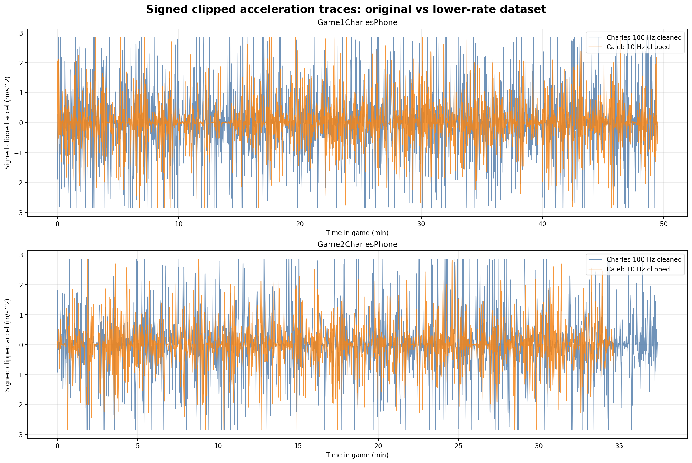
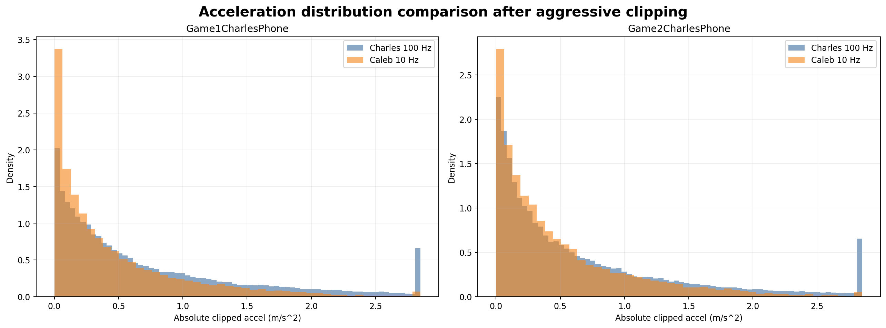

# Lower-Rate Second Dataset Analysis Report

## Goal

This report reruns the clipped motor and voltage analysis on the new lower-rate HyperIMU recording
([BothGamesCalebPhone.csv](/home/chafri/Documents/seniorDesign/data/raw/BothGamesCalebPhone.csv))
and compares it against the existing cleaned Charles gameplay files.

## Shared Assumptions

- Total system mass: `105 kg`
- Wheel radius: `11.75 in`
- Two-wheel drive with one motor per wheel
- Gear ratio: `16:1`
- Rolling resistance coefficient: `0.002`
- Wheel rotational inertia: `0.2 kg·m^2` per driven wheel
- No slope
- Aggressive clipping: signed acceleration limited to `+/- 2.85 m/s^2`
- Motor assumption: 450 W planetary gear BLDC family used in the earlier study

## How The Second Dataset Was Prepared

The HyperIMU file did not contain explicit timestamps per sample, so it was reconstructed from its
metadata header (`100 ms` sampling interval) and then split into game windows using the same absolute
time windows as the Charles cleaned game files.

### Lower-rate window manifest

| game_name | source_rows | start_time | end_time | duration_min |
| --- | --- | --- | --- | --- |
| Game1CalebPhone | 29700 | 2026-03-24 17:44:03-06:00 | 2026-03-24 18:33:32.900000-06:00 | 49.50 |
| Game2CalebPhone | 20806 | 2026-03-24 18:43:08.900000-06:00 | 2026-03-24 19:17:49.400000-06:00 | 34.67 |

## Key 48 V Comparison

| dataset | game_name | session_energy_wh | peak_electrical_power_w | peak_pack_current_a | peak_wheel_torque_per_motor_nm | required_peak_motor_torque_nm | required_peak_motor_current_a | clipped_positive_samples | clipped_negative_samples |
| --- | --- | --- | --- | --- | --- | --- | --- | --- | --- |
| caleb_low_rate | Game1CalebPhone | 288.05 | 2019.67 | 42.08 | 47.87 | 3.32 | 27.24 | 59 | 55 |
| charles_cleaned | Game1CharlesPhone | 414.61 | 2019.67 | 42.08 | 47.87 | 3.32 | 27.24 | 3674 | 3801 |
| caleb_low_rate | Game2CalebPhone | 291.28 | 2019.67 | 42.08 | 47.87 | 3.32 | 27.24 | 20 | 43 |
| charles_cleaned | Game2CharlesPhone | 371.95 | 2019.67 | 42.08 | 47.87 | 3.32 | 27.24 | 3122 | 2507 |

## Figures

### Signed clipped acceleration traces

### Acceleration distribution comparison

### Peak pack current across candidate voltages

### Peak torque and power at 48 V

## Interpretation

- The lower-rate dataset is useful as a second opinion because it records the same games with a very different sampling profile.
- Because it is much lower rate than the Charles phone, it will naturally smooth or miss short spikes that the higher-rate data can see.
- That means the Caleb file is not automatically “more correct,” but it is valuable for checking whether conclusions depend entirely on very sharp high-frequency events.
- The aggressive clipping rule prevents either dataset from dominating the analysis with unrealistic collision or body-motion spikes.
- The most important shared outputs for design remain peak wheel torque, peak motor torque/current, peak electrical power, and peak pack current at each candidate voltage.

## Output Files

- Summary CSV: [second_dataset_summary.csv](/home/chafri/Documents/seniorDesign/data/processed/second_dataset_report/second_dataset_summary.csv)
- Summary JSON: [second_dataset_summary.json](/home/chafri/Documents/seniorDesign/data/processed/second_dataset_report/second_dataset_summary.json)
- Report figures: [figures](/home/chafri/Documents/seniorDesign/data/processed/second_dataset_report/figures)
